# ISED User's Manual (V3.5)

## 目录导航

### 1. ISED (Integrated System Energy Designer) - At a Glance
- [Basic Functionality](#basic-functionality)
- [User Interface Basics](#user-interface-basics)
  - Title Bar
  - Menu Bar
  - Tool Bar
  - Tabs
  - Result View
  - Financial Tool
  - Seaview
  - General Features

### 2. Project Tab
- [Project Information](#project-information)
  - Customer
  - Project Name
  - Project Lifetime
  - Carbon Tax
  - Project WACC
  - Project Currency
  - Project Notes
- [Set Location](#set-location)
  - Overview
  - Location
  - Meteonorm
- [List of Stakeholders](#list-of-stakeholders)
- [Energy Values for Project LCOE](#energy-values-for-project-lcoe)
- [Topology](#topology)

### 3. Resources Tab
- [Time Series](#time-series)
  - View Time Series
  - Timeseries Database
  - Timeseries Editor
  - Add Time Series
  - Export Time Series
  - Remove Time Series
- [Fuel](#fuel)
  - Add Cost
  - Remove Cost
  - Add Fuel
  - Remove Fuel
  - Save to Library

### 4. Decarbonization Study
- [Overview](#decarbonization-overview)
- [Workflow](#decarbonization-workflow)
- [Environmental Tradeoff Analysis](#environmental-tradeoff-analysis)

### 5. Equipment Tab
- [Basic Functionality](#equipment-basic-functionality)
- [User Interface Basics](#equipment-ui-basics)
  - Asset Library
  - Parameters
- [Special Parameter Types](#special-parameter-types)
  - Price Matrix
  - Heat Balance Table
  - Minimum or Maximum Power Output
  - Outages Schedule
  - Availability
  - Replacement Strategy
  - Other Common Parameters
- [Loads](#loads)
  - Electric Load
  - Deferrable Load
  - Thermal Load
  - Hydrogen Load
- [External Energy Networks](#external-energy-networks)
  - Grid
  - District Heating / Cooling
  - Hydrogen Network
- [Electrical Equipment](#electrical-equipment)
  - Electric Vehicle Charging Station (EVStation)
  - InternalPV
  - ImportedPV
  - Wind Turbine
  - ImportedWT
  - Energy Storage System
  - GenSet
  - Cable
- [Thermal Equipment](#thermal-equipment)
  - CHP (GasEngine)
  - Gas Turbine
  - Steam Turbine
  - Boiler
  - Heat Pump
  - Absorption Chiller
  - Compression Chiller
  - Thermal Storage
  - Thermal Vent
  - Thermal Valve
- [Hydrogen Equipment](#hydrogen-equipment)
  - Electrolyzer
  - Hydrogen Compressor
  - Hydrogen Storage
  - Hydrogen Valve
  - Fuel Cell
  - Hydrogen Turbine
  - Process Plant
  - Others
- [Central Equipment](#central-equipment)
- [Bus](#bus)

### 6. Topology Tab
- [Tool Bar](#topology-toolbar)
- [Asset Library](#topology-asset-library)
- [Topology Window](#topology-window)

### 7. Simulation and Dispatcher Tab
- [Simulation Parameters](#simulation-parameters)
- [Logging](#logging)
- [Fault Finding](#fault-finding)
- [Dispatcher Parameters](#dispatcher-parameters)
  - Common Parameters
  - Economic Inputs for Dispatcher
  - Charging Incentives
- [Dispatcher Variations](#dispatcher-variations)
  - Comparison Overview
  - Robust Single-Step
  - Fast Single-Step
  - Multi-Step
  - MGC
  - Local Control

### 8. Configuration Selection Dialog

### 9. Run Simulations Tab

### 10. Result View Popup
- [UI Overview](#result-ui-overview)
- [Financial Analysis](#financial-analysis)
- [KPIs](#kpis)
  - KPI TableView
  - Messages
  - KPI Overview
  - KPIs for Project Lifetime

### 11. Seaview
- [Basic Functionality](#seaview-basic-functionality)
- [User Interface Basics](#seaview-ui-basics)
- [Data Import](#seaview-data-import)

### 12. Financial Tool
- [Overview](#financial-tool-overview)
- [Financial Tool Layout](#financial-tool-layout)
- [Setup Tab](#setup-tab)
  - Overview
  - Modify Inputs
  - Tariff Optimization
  - Assets
  - Financing
  - Debt
  - Tariffs
  - Reserve Accounts
- [Graphs - General Function](#graphs-general-function)
  - Tariffs
  - Sensitivity Analysis
- [Comparison Tab](#comparison-tab)
  - Configuration Selection
  - Generation
  - Cashflow
  - Financial
  - Environmental
- [Analysis Tab](#analysis-tab)
  - Results
  - Sensitivity Analysis
  - Summary
  - Generation
  - Cashflow
  - Financial
  - Inflation

### 13. Appendix
- [Abbreviations](#abbreviations)

---

## 详细内容

### Basic Functionality {#basic-functionality}

ISED (Integrated System Energy Designer) 是一个集成的系统能源设计工具，提供以下基本功能：

- 项目管理和配置
- 资源和时间序列管理
- 设备库和拓扑设计
- 模拟和调度优化
- 结果分析和财务评估

### User Interface Basics {#user-interface-basics}

#### Title Bar
显示应用程序名称和版本信息

#### Menu Bar
提供主要菜单选项和功能访问

#### Tool Bar
包含常用工具和快速操作按钮

#### Tabs
主要工作区分为多个标签页：
- Project Tab
- Resources Tab
- Equipment Tab
- Topology Tab
- Simulation and Dispatcher Tab
- Run Simulations Tab

#### Result View
显示模拟结果和分析数据

#### Financial Tool
用于财务分析和评估

#### Seaview
数据可视化和展示工具

#### General Features
通用功能和设置

### Project Information {#project-information}

项目信息包括以下参数：

| 参数 | 说明 |
|------|------|
| Customer | 客户名称 |
| Project Name | 项目名称 |
| Project Lifetime | 项目生命周期（年） |
| Carbon Tax | 碳税 |
| Project WACC | 加权平均资本成本 |
| Project Currency | 项目货币 |
| Project Notes | 项目备注 |

### Set Location {#set-location}

#### Overview
设置项目地理位置，用于获取气象数据和计算太阳辐照度

#### Location
输入项目的地理坐标或选择预定义位置

#### Meteonorm
集成Meteonorm气象数据库，提供全球气象数据

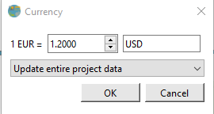

### List of Stakeholders {#list-of-stakeholders}

定义项目的利益相关者，包括：
- 项目所有者
- 投资者
- 运营商
- 其他相关方

### Energy Values for Project LCOE {#energy-values-for-project-lcoe}

设置用于计算项目LCOE（平准化能源成本）的能源价值参数

### Topology {#topology}

定义系统拓扑结构，包括：
- 能源生产设备
- 存储设备
- 负荷
- 网络连接

### Time Series {#time-series}

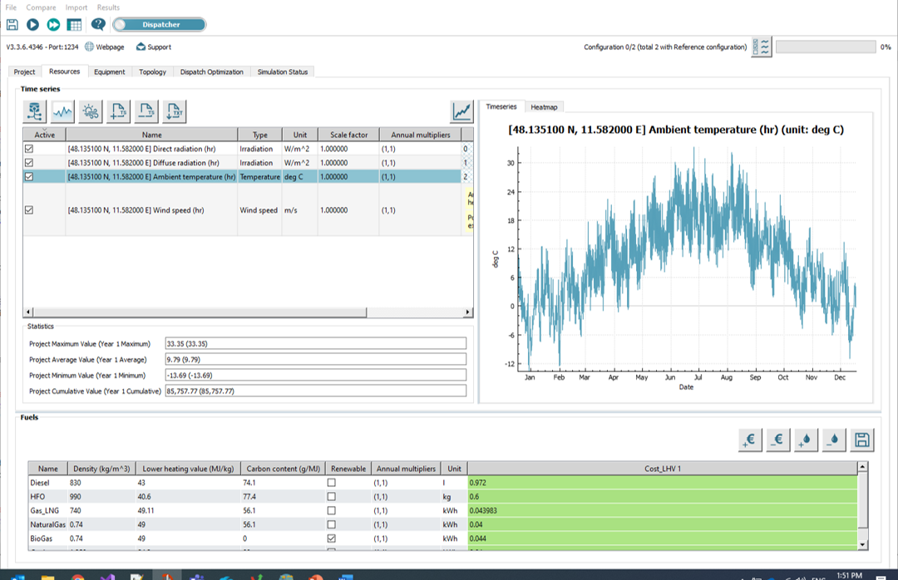

#### View Time Series
查看和编辑时间序列数据

#### Timeseries Database
访问时间序列数据库

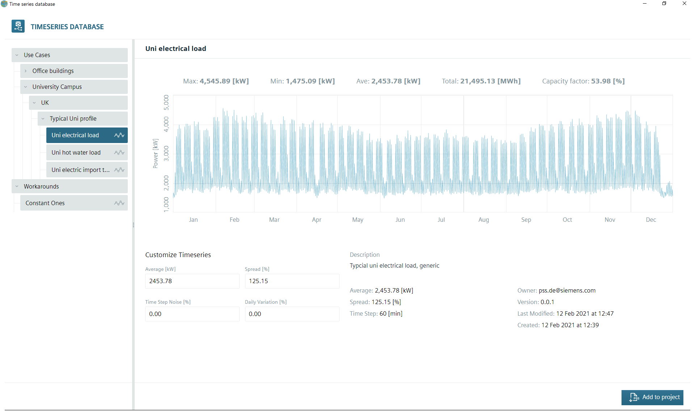

#### Timeseries Editor
编辑和创建自定义时间序列

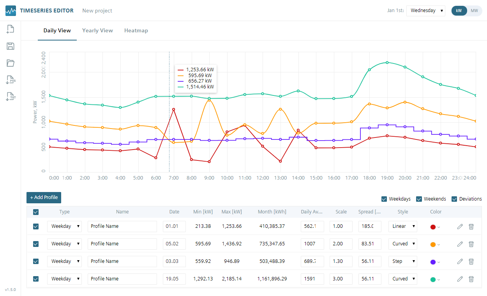

#### Add Time Series
添加新的时间序列数据

#### Export Time Series
导出时间序列数据

#### Remove Time Series
删除不需要的时间序列

### Fuel {#fuel}

#### Add Cost
添加燃料成本

#### Remove Cost
删除燃料成本

#### Add Fuel
添加新的燃料类型

#### Remove Fuel
删除燃料类型

#### Save to Library
保存燃料配置到库

### Decarbonization Overview {#decarbonization-overview}

去碳化研究用于分析和优化系统的碳排放

### Decarbonization Workflow {#decarbonization-workflow}

1. 定义参考配置
2. 设置去碳化目标
3. 运行优化模拟
4. 分析结果

### Environmental Tradeoff Analysis {#environmental-tradeoff-analysis}

分析成本和环境影响之间的权衡

### Equipment Basic Functionality {#equipment-basic-functionality}

设备模块用于定义和配置系统中的所有设备。在此选项卡上，用户可以：
- 查看不同技术类型的资产库
- 通过连接资产来创建能源系统
- 通过设置参数值来自定义资产

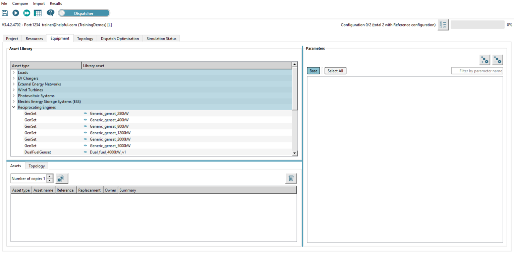

### Equipment UI Basics {#equipment-ui-basics}

#### Asset Library
设备资产库，包含预定义的设备模型

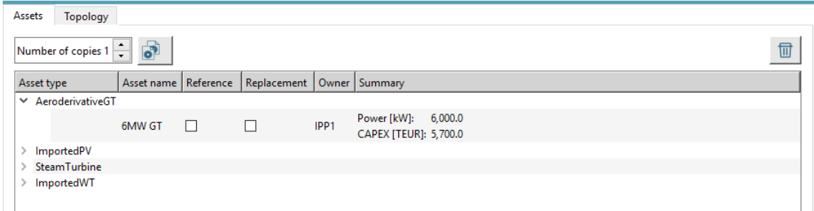

资产库部分显示可用资产的表格，包含以下数据：
- **资产类型 (Asset type)**: 资产的类型
- **库资产 (Library asset)**: 资产的名称，标识特定的库资产

**许可证说明**:
- 小型许可证 (S): 仅包含电气资产类型
- 中型许可证 (M): 包含电气和热力资产类型  
- 大型许可证 (L): 包含电气、热力和氢能资产类型

**支持的资产类别**:
- **负荷**: Load, DeferrableLoad, SteamLoad, HotWaterLoad, ColdWaterLoad, H2Load
- **电动汽车充电站**: EVStation
- **外部能源网络**: Grid, DistrictSteam, DistrictCooling, DistrictHeating, H2Network
- **风力涡轮机**: ImportedWT, WindTurbine
- **光伏系统**: ImportedPV, InternalPV
- **电能储存**: Energy Storage System, LithiumIonBatter
- **往复式发动机**: GenSet, DualFuelGenset, CHP
- **燃气轮机**: AeroderivativeGT, IndustrialGT, LargeFrameGT, GenericGT, H2Turbine
- **蒸汽系统**: SteamLoad, SteamTurbine, SteamBoiler, CoalFiredSteamBoiler, ElectricSteamBoiler, HighTemperatureStorage, SteamValve, SteamVent
- **热水系统**: HotWaterLoad, DistrictHeating, HotWaterBoiler, CoalFiredHotWaterBoiler, ElectricHotWaterBoiler, HeatPump, HotWaterStorage, HotWaterValve, HotWaterVent
- **冷水系统**: ColdWaterLoad, DistrictCooling, AbChiller, CompressionChiller, ColdWaterStorage, ColdWaterValve, ColdWaterVent
- **电缆、阀门和排气**: Cable, ElectricLoadBank, H2Compressor, H2Valve
- **氢能系统**: H2Load, H2Network, Electrolyzer, H2Turbine, H2FuelCell, H2Compressor, H2Valve, Process Plant
- **氢能储存**: H2Storage
- **中央设备**: FixedCosts, MGC, Multi-Step

#### Parameters
设备参数配置

参数部分显示所选资产的参数及其值。

**参数类别**:
- **Base**: 显示基础参数
- **其他类别**: 可以启用或禁用以显示特定类别的参数

**参数表列**:
- **参数 (Parameter)**: 参数名称
- **Base**: 此配置的基础参数值
- **Variation**: 包含在搜索空间中的参数的所有变化

### Special Parameter Types {#special-parameter-types}

每个资产类型都有一些对该特定类型唯一的参数。但是，许多参数在许多或所有资产之间是通用的。这里描述了其中一些参数，特别是那些特别复杂的参数。

#### Price Matrix
价格矩阵用于定义成本随容量或其他参数的变化

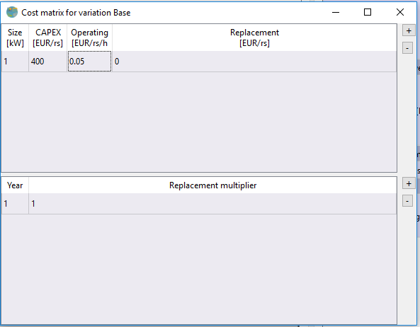
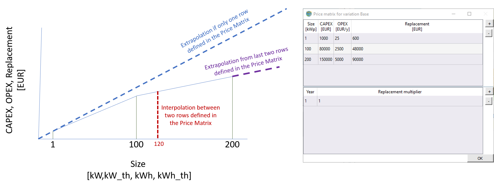

价格矩阵对所有资产都很常见，描述资产的主要经济方面：

- **Size (尺寸)**: 设置价格的尺寸
- **CAPEX**: 资产的初始价格
- **OPEX**: 资产的小时成本
- **Replacement Price (替换价格)**: 替换资产的价格
- **Annual Multiplier (年度乘数)**: 替换成本的乘数
- **Year (年份)**: 应用乘数的年份

价格矩阵可以有多行，每行列出特定的尺寸及其对应的CAPEX、OPEX和替换价格。其他尺寸的价格可以通过插值或外推计算。

#### Heat Balance Table
热平衡表用于定义热设备的性能

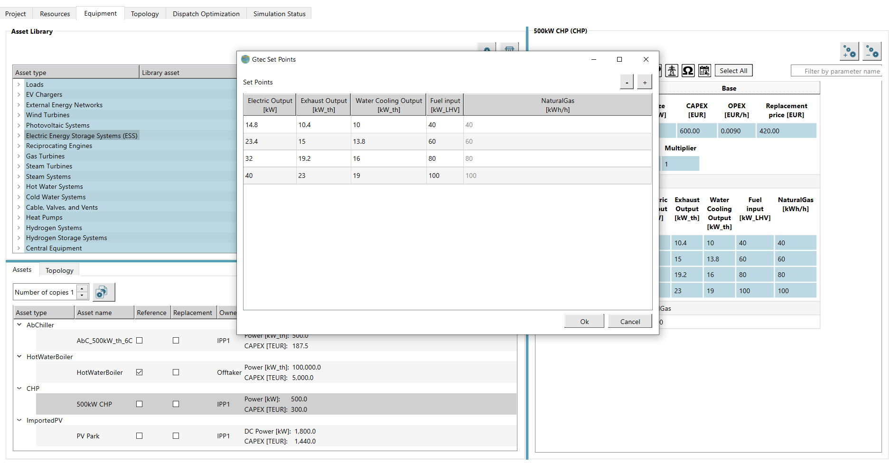

某些资产允许用户直接输入资产内所有功率和燃料流的一系列设定点。

**关键概念**:
- 如果"额定功率"参数与热平衡表最后一行的输出功率值不同，则所有值（功率、燃料消耗、氢气等）按因子 Rated power / Output power 缩放
- 这确保效率保持不变

**对称性破缺**:
当配置中有两个或多个相同的资产时，可能会出现无限数量的不同功率调度解决方案。ISED使用对称性破缺技术来加快找到最优解的速度。

#### Minimum or Maximum Power Output
定义设备的最小/最大功率输出

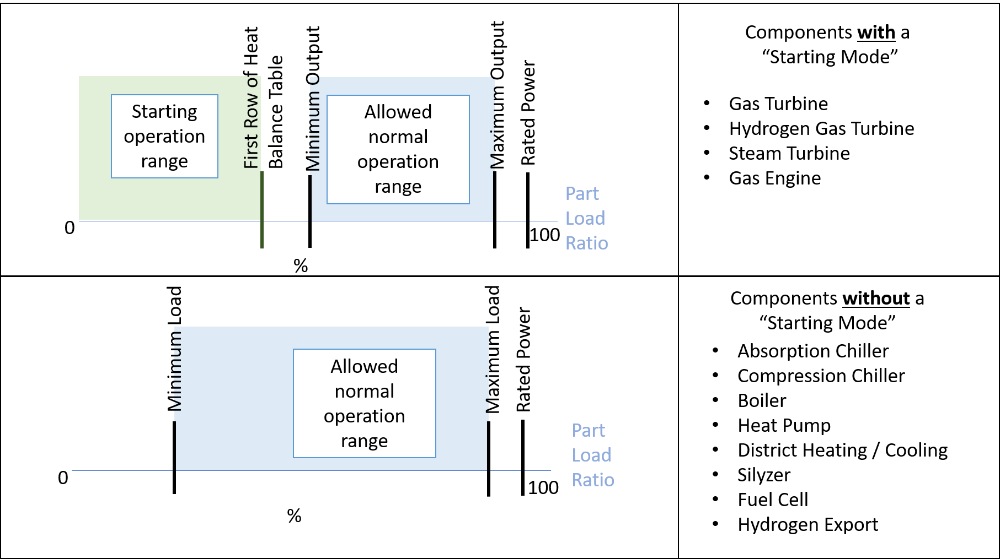

许多具有热平衡表的资产包含描述最小和最大输出功率（作为时间函数）的参数。

**对于具有启动模式的资产** (燃气轮机、燃气发动机、蒸汽涡轮机):
- 最小输出功率 < 热平衡表第一行 → 使用热平衡表第一行
- 最小输出功率 > 热平衡表第一行 → 使用最小输出功率
- 最大输出功率 < 热平衡表最后一行 → 使用最大输出功率
- 最大输出功率 > 热平衡表最后一行 → 使用热平衡表最后一行

**对于没有启动模式的资产** (锅炉、压缩式冷机、热泵、电解槽、燃料电池):
- 最小和最大输出功率始终有效（只要它们在0-100%之间）

#### Outages Schedule
定义设备的计划停机时间

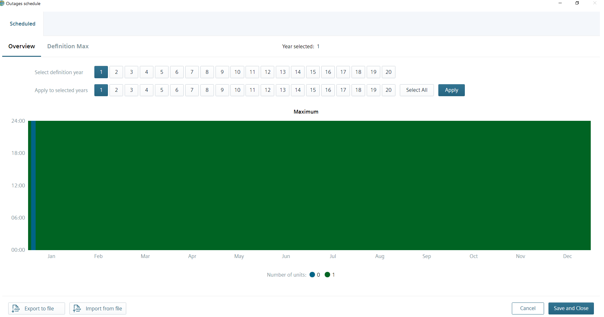
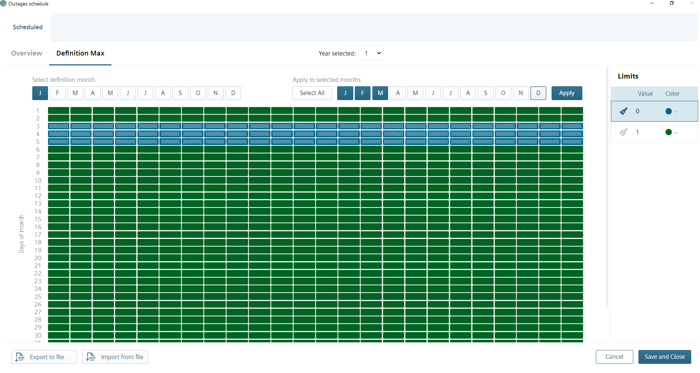

许多资产有停机计划，反映资产的计划/非计划停机时间。在这些时期，资产可能无法生产或消耗功率。

**定义停机时间**:
- 用户选择一年并切换到"Definition Max"选项卡
- 在此处，用户可以通过将相应的停机小时标记为"0"（默认颜色=蓝色）来定义每个月中每一天的停机时间
- 用户可以将定义的任何月份的停机时间应用到任何其他月份
- 切换回概览时，一年的停机计划也可以应用到其他年份

#### Availability
定义设备的可用性

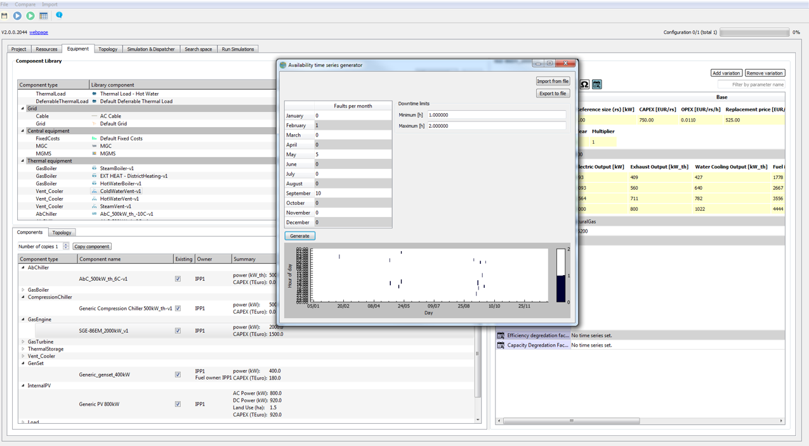

许多资产有可用性参数，允许用户包含计划或非计划停机时间。

**定义非计划停机时间**:
- 定义全年每个月的预期故障次数
- 设置每次发生的最小和最大停机时间

**定义计划停机时间**:
- 通过文本文件加载配置文件
- 有效文件每行有两个值：(时间戳) (值)
- 时间戳是从年初开始的秒数
- 值=0表示停机，值=1表示不停机

#### Replacement Strategy
定义设备的更换策略

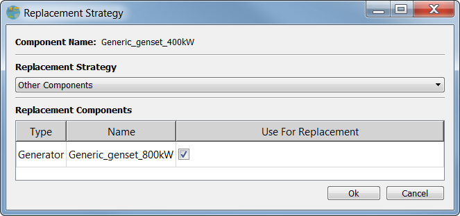

许多资产有替换策略参数，允许用户指定资产达到使用寿命后会发生什么。

**三种替换策略**:

1. **默认策略**: 资产被相同配置的相同资产替换，但生命周期计数器重置为最大生命周期

2. **移除策略**: 资产在达到使用寿命后从部署中移除

3. **替换为其他资产**: 资产在达到使用寿命后被移除，并安装一个或多个其他替换资产

#### Other Common Parameters
其他常见参数

- **Must Run (必须运行)**: 如果设置为"true"，则始终强制执行最小允许功率。如果最小允许功率不为零，这意味着该单元必须运行，不能关闭

- **Maximum annual full load hours (最大年度满负荷小时数)**: 每个单元在一年内允许运行的满负荷小时数

- **Maximum annual running hours (最大年度运行小时数)**: 每个单元在一年内允许运行的小时数

- **Full load scaling factor (满负荷缩放因子)**: 与资产额定容量成比例的值，用于确定资产在一年内运行的"满负荷小时数"

### Loads {#loads}

#### Electric Load
电力负荷定义

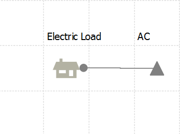

**概述**:
电气负载是满足DES客户需求的负载。通常不包含损耗。电气负载可能被分配不满足它的成本。

**参数 - 按类别**:

**容量 (Capacity)**
- **Load [kW]**: 描述请求负载的时间序列 [kW]
- **Default load [kW]**: 未设置"Load[kW]"时间序列时使用的值

**稳定性 (Stability - Grid, OR)**
- **Operating reserve**: 调度员必须确保可用的额外能量
- **Relative Operating reserve [pu]**: 所需相对运行备用的时间序列
- **Default relative operating reserve [pu]**: 未设置时间序列时使用的值
- **Peak Operating Reserve [pu]**: 所需峰值运行备用的时间序列
- **Default Peak Operating Reserve [pu]**: 未设置时间序列时使用的值
- **Requires redundancy**: 如果为true，负载需要冗余发电能力

**脱落 (Shedding)**
- **Shedding priority**: 脱落优先级（-1为主要负载）
- **Starting priority**: 启动优先级
- **Shedding event cost [EUR]**: 负载脱落时的一次性成本
- **Shedding time cost [EUR/h]**: 负载脱落时的小时成本
- **Minimum shedding duration [s]**: 安全运行恢复前的最小停机时间
- **Ramp rate after shedding [%/s]**: 脱落事件后的负载上升速率

**时间 (Time)**
- **Installation delay [y]**: 模拟开始后资产安装的时间延迟（年）

#### Deferrable Load
可延迟负荷定义

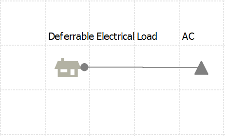

**概述**:
这是一种可以连接到储存库的负载。负载和储存库一起允许配置可延迟负载，即必须在某个时刻满足但由存储解耦的负载。

**参数 - 按类别**:

**经济 (Economics)**
- **Charging incentive [EUR/kWh]**: 可延迟负载仅在功率成本低于此值时增加存储

**容量 (Capacity)**
- **Load [m³/h]**: 可延迟负载存储的出口流量时间序列
- **Default load [m³/h]**: 未设置时间序列时使用的值
- **Conversion curve [x: kW, y:m³/h]**: 定义从电输入功率到入口流量的传递函数
- **Storage capacity [m³]**: 可延迟负载的最大容量
- **Maximum capacity timeseries [%]**: 定义最大允许存储容量分数的时间序列
- **Default maximum capacity [%]**: 未设置时间序列时使用的值
- **Minimum capacity timeseries [%]**: 定义最小允许存储容量分数的时间序列
- **Default minimum capacity [%]**: 未设置时间序列时使用的值

**稳定性 (Stability)**
- **Relative Operating reserve [pu]**: 所需相对运行备用的时间序列
- **Default relative operating reserve [pu]**: 未设置时间序列时使用的值
- **Peak Operating Reserve [pu]**: 所需峰值运行备用的时间序列
- **Default Peak Operating Reserve [pu]**: 未设置时间序列时使用的值
- **Requires redundancy**: 如果为true，负载需要冗余发电能力

#### Thermal Load
热负荷定义

热负荷代表系统中的热能需求。

#### Hydrogen Load
氢气负荷定义

氢气负荷代表系统中的氢气需求。

### External Energy Networks {#external-energy-networks}

#### Grid
电网连接

电网资产代表与外部电力系统的连接。

**主要参数**:
- 电网连接功率限制
- 电价和费率
- 导入/导出限制
- 碳排放因子

#### District Heating / Cooling
区域供热/制冷网络

代表与区域供热或冷却网络的连接。

**主要参数**:
- 供热/冷却功率限制
- 温度设定点
- 成本参数

#### Hydrogen Network
氢气网络

代表与外部氢气网络的连接（高压和低压）。

**主要参数**:
- 氢气流量限制
- 压力设定点
- 成本参数

### Electrical Equipment {#electrical-equipment}

#### Electric Vehicle Charging Station (EVStation)
电动汽车充电站

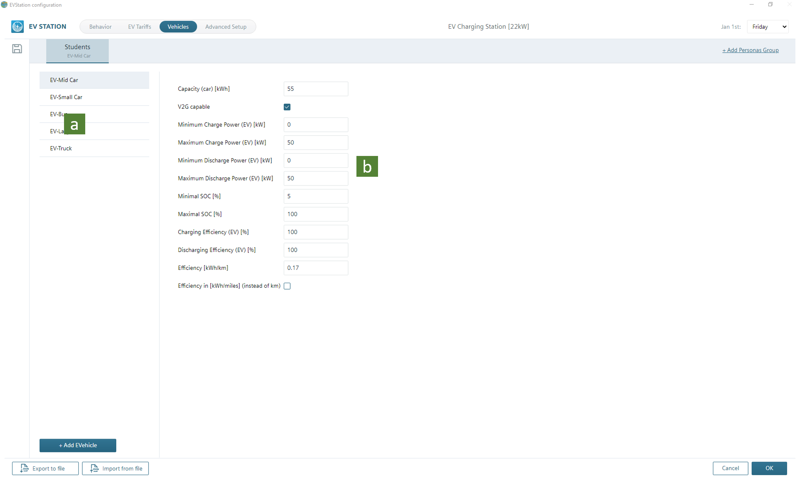
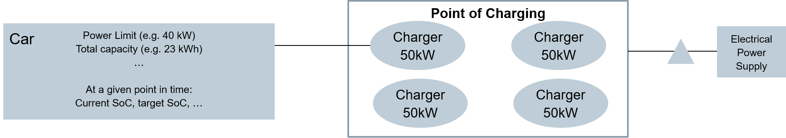
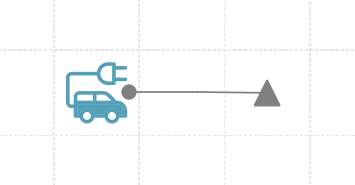

电动汽车充电站管理电动汽车的充电。

**主要参数**:
- 充电功率
- 车辆类型和电池容量
- 充电计划和优先级
- 成本参数

#### InternalPV
内部光伏系统

内部光伏系统基于位置的太阳辐射数据生成功率。

**主要参数**:
- 额定功率 [kW]
- 倾斜角和方位角
- 温度系数
- 效率参数

#### ImportedPV
导入的光伏数据

使用导入的时间序列数据的光伏系统。

**主要参数**:
- 额定功率 [kW]
- 导入的功率时间序列

#### Wind Turbine
风力涡轮机

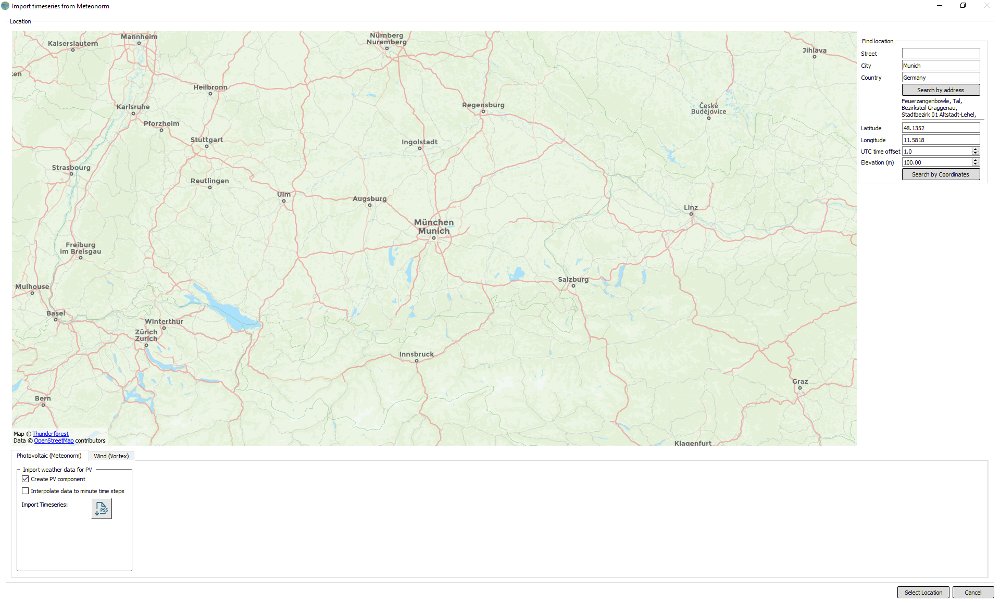

风力涡轮机基于位置的风速数据生成功率。

**主要参数**:
- 额定功率 [kW]
- 轮毂高度
- 风速曲线
- 功率曲线

#### ImportedWT
导入的风力数据

使用导入的时间序列数据的风力涡轮机。

**主要参数**:
- 额定功率 [kW]
- 导入的功率时间序列

#### Energy Storage System
能源存储系统

电能储存系统（如电池）存储电能以供后续使用。

**主要参数**:
- 容量 [kWh]
- 功率 [kW]
- 充放电效率
- 循环寿命
- 成本参数

#### GenSet
发电机组

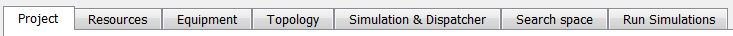

往复式发动机发电机组。

**主要参数**:
- 额定功率 [kW]
- 热平衡表
- 燃料类型
- 启动成本和时间
- 最小/最大功率

#### Cable
电缆

电缆连接系统中的不同组件。

**主要参数**:
- 电阻
- 容量
- 成本参数

### Thermal Equipment {#thermal-equipment}

#### CHP (GasEngine)
燃气发动机热电联产

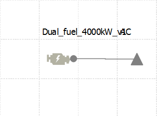

热电联产系统同时生成电力和热力。

**主要参数**:
- 额定电功率 [kW]
- 热平衡表
- 燃料类型
- 热效率
- 电效率

#### Gas Turbine
燃气轮机

燃气轮机生成电力。

**主要参数**:
- 额定功率 [kW]
- 热平衡表
- 启动模式
- 温度修正
- 最小/最大功率

#### Steam Turbine
蒸汽轮机

蒸汽涡轮机从蒸汽生成电力。

**主要参数**:
- 额定功率 [kW]
- 热平衡表
- 蒸汽压力和温度
- 最小/最大功率

#### Boiler
锅炉

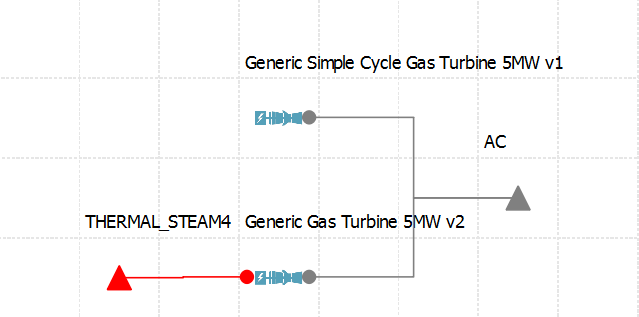

锅炉使用燃料生成热力。

**主要参数**:
- 额定热功率 [kW]
- 热平衡表
- 燃料类型
- 效率
- 最小/最大功率

#### Heat Pump
热泵

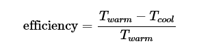
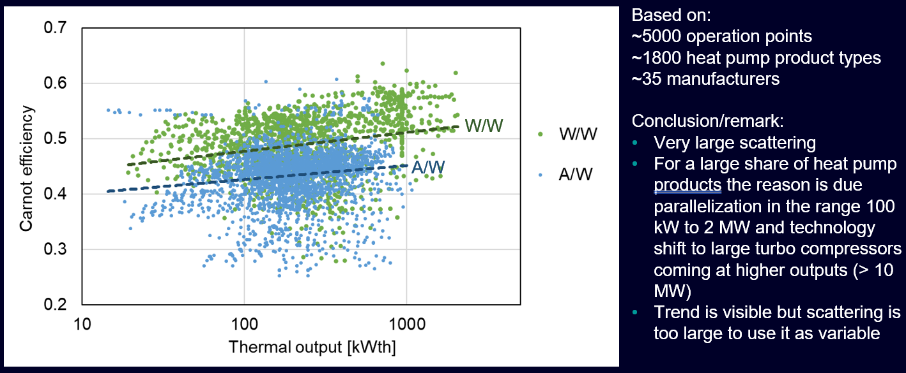

热泵使用电力从低温源提取热量并将其传递到高温。

**主要参数**:
- 额定热功率 [kW]
- 热平衡表
- COP (性能系数)
- 源和汇温度
- 最小/最大功率

#### Absorption Chiller
吸收式冷却机

吸收式冷机使用热力生成冷却。

**主要参数**:
- 额定冷功率 [kW]
- 热平衡表
- 热源温度
- COP
- 最小/最大功率

#### Compression Chiller
压缩式冷却机

压缩式冷机使用电力生成冷却。

**主要参数**:
- 额定冷功率 [kW]
- 热平衡表
- COP
- 最小/最大功率

#### Thermal Storage
热储存

热储存系统存储热能或冷能以供后续使用。

**主要参数**:
- 容量 [kWh]
- 功率 [kW]
- 充放热效率
- 热损耗
- 成本参数

#### Thermal Vent
热排气

热排气允许系统释放多余的热力。

**主要参数**:
- 最大排气功率 [kW]
- 成本参数

#### Thermal Valve
热阀门

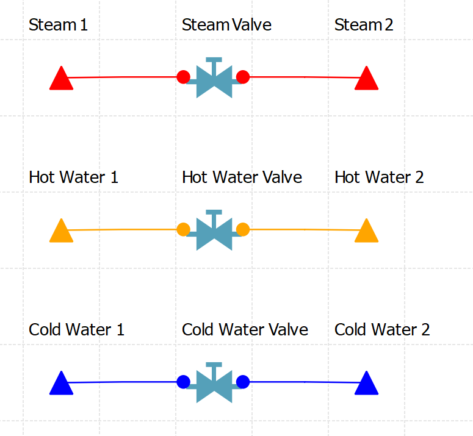

热阀控制热流在系统中的流向。

**主要参数**:
- 最大流量
- 压力降
- 成本参数

### Hydrogen Equipment {#hydrogen-equipment}

#### Electrolyzer
电解槽

电解槽使用电力将水分解为氢气和氧气。

**主要参数**:
- 额定氢气产量 [kg/h]
- 热平衡表
- 电效率
- 最小/最大功率
- 启动时间

#### Hydrogen Compressor
氢气压缩机

氢气压缩机将氢气压缩到更高的压力。

**主要参数**:
- 额定流量 [kg/h]
- 热平衡表
- 压缩比
- 效率
- 最小/最大功率

#### Hydrogen Storage
氢气储存

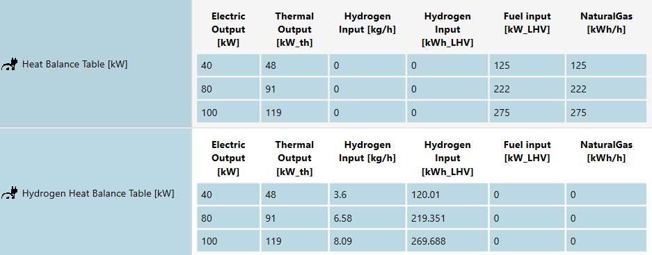

氢气储存系统存储氢气以供后续使用。

**主要参数**:
- 容量 [kg]
- 功率 [kg/h]
- 充放气效率
- 泄漏率
- 成本参数

#### Hydrogen Valve
氢气阀门

氢气阀控制氢气在系统中的流向。

**主要参数**:
- 最大流量 [kg/h]
- 压力降
- 成本参数

#### Fuel Cell
燃料电池

燃料电池使用氢气生成电力。

**主要参数**:
- 额定功率 [kW]
- 热平衡表
- 效率
- 最小/最大功率
- 启动时间

#### Hydrogen Turbine
氢气轮机

氢气涡轮机使用氢气生成电力。

**主要参数**:
- 额定功率 [kW]
- 热平衡表
- 效率
- 最小/最大功率
- 启动时间

#### Process Plant
工业过程设备

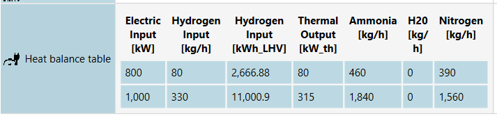

工艺厂（如氨厂）使用氢气作为原料进行化学过程。

**主要参数**:
- 额定产量
- 热平衡表
- 原料消耗
- 热需求
- 成本参数

#### Others
其他氢气设备

包括各种辅助设备和专用应用。

### Central Equipment {#central-equipment}

中央设备用于表示与整个项目相关的成本和控制策略。

#### Fixed Costs
固定成本资产用于表示与项目相关的固定成本。

**主要参数**:
- 年度固定成本 [EUR/year]
- 成本类别

#### MGC (Multi-Agent Control)
多代理控制系统用于高级调度和控制策略。

**主要参数**:
- 控制参数
- 优先级设置
- 成本参数

#### Multi-Step
多步调度器用于复杂的多步优化。

**主要参数**:
- 步长参数
- 优化设置
- 成本参数

### Bus {#bus}

能源总线定义

### Topology Toolbar {#topology-toolbar}

拓扑编辑工具栏

### Topology Asset Library {#topology-asset-library}

拓扑编辑中的资产库

### Topology Window {#topology-window}

拓扑编辑窗口

### Simulation Parameters {#simulation-parameters}

定义模拟参数：
- 模拟时间范围
- 时间步长
- 模拟模式

### Logging {#logging}

模拟日志记录

### Fault Finding {#fault-finding}

故障诊断工具

### Dispatcher Parameters {#dispatcher-parameters}

#### Common Parameters
调度器通用参数

#### Economic Inputs for Dispatcher
调度器经济输入

#### Charging Incentives
充电激励

### Dispatcher Variations {#dispatcher-variations}

#### Comparison Overview
调度器变体比较

#### Robust Single-Step
鲁棒单步调度

#### Fast Single-Step
快速单步调度

#### Multi-Step
多步调度

#### MGC
MGC调度

#### Local Control
本地控制

### Result UI Overview {#result-ui-overview}

结果视图用户界面概览

### Financial Analysis {#financial-analysis}

财务分析工具

### KPIs {#kpis}

关键性能指标

#### KPI TableView
KPI表格视图

#### Messages
消息和警告

#### KPI Overview
KPI概览

#### KPIs for Project Lifetime
项目生命周期KPI

### Seaview Basic Functionality {#seaview-basic-functionality}

Seaview基本功能

### Seaview UI Basics {#seaview-ui-basics}

Seaview用户界面基础

### Seaview Data Import {#seaview-data-import}

Seaview数据导入

### Financial Tool Overview {#financial-tool-overview}

财务工具概览

### Financial Tool Layout {#financial-tool-layout}

财务工具布局

### Setup Tab {#setup-tab}

设置标签页

### Graphs General Function {#graphs-general-function}

图表通用功能

### Comparison Tab {#comparison-tab}

比较标签页

### Analysis Tab {#analysis-tab}

分析标签页

### Abbreviations {#abbreviations}

缩写词汇表

---

## 快速开始

1. **创建新项目** - 在Project Tab中输入项目信息
2. **设置位置** - 设置项目地理位置以获取气象数据
3. **添加资源** - 在Resources Tab中添加时间序列和燃料数据
4. **配置设备** - 在Equipment Tab中选择和配置设备
5. **设计拓扑** - 在Topology Tab中连接设备
6. **运行模拟** - 在Simulation Tab中配置参数并运行模拟
7. **分析结果** - 在Result View中查看和分析结果
8. **财务评估** - 使用Financial Tool进行财务分析

---

## 联系和支持

如有问题或需要支持，请联系技术团队。

**文档版本：** V3.5  
**最后更新：** 2026年1月
